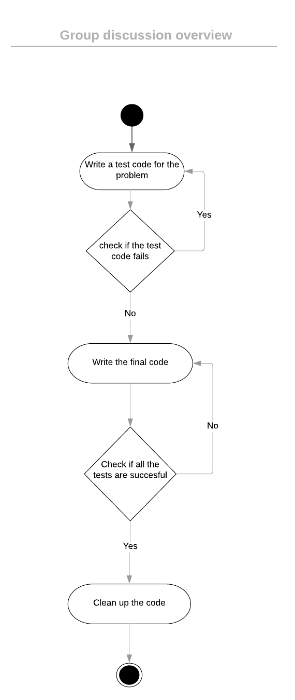

### PID Controller implementation from ACME Robotics. 

Welcome to Acme Robotics. Here, we present a PID for our new mobile
robot product.

A PID controller is a closed loop controller which uses feedback
mechanism. A PID controller continuously calculates an error value e(t)
as the difference between a desired set-point (SP) and a measured
process variable (PV) and applies a correction based on proportional,
integral, and derivative terms (denoted by P, I, and D respectively).

### Prelude

Logic : changeCalculatedByPID = Kp*(expectedValue-currentValue)+Kd*(previousValue-CurrentValue)+(previousIntegral+Ki*currentError)

In the above formula, we see that the PID output is an summation of the
proportional term, the derivative term and the integral term.

### Implementation Details

The implementation inputs variables kp, kd and ki. It defines a compute
function which calculates the corrected velocity, given a set-point. The
implementation is done in C++ and Google style guides have been
followed. We initially stub the compute function to verify the pipeline
sanity and work across teams to have the full implementation

### Code Coverage and Travis

The link to code coverage can be found here

### Travis path :

### Coveralls :

### Compiling and Running

store the file in your home directory

cd &lt;path to directory&gt;

cd /AcmeRoboticsPIDcontroller_week5/

mkdir build

cd build

cmake ..

make

cd ..

cppcheck --enable=all --std=c++11 -I include/ --suppress=missingIncludeSystem $( find . -name *.cpp | grep -vE -e "^./build/" -e "^./vendor/" )

To run program: ./app/shell-app

To test program: ./test/cpp-test

### Group Discussion overview

We reached a conclusion of creating separate git branches for part b for team A and team B like we did for part A. We discussed on the UML diagrams, possible test cases like Divide by zero error, which can occur during compute function. We agreed on the unit test design architecture for our software and that the merge to the master would be done upon proper review by the Navigator. The following diagram represents an overview of the overall software architecture for testing.

### Contributors

Part A
-Shivam Akhauri (Driver)
-Chinmay Joshi (Navigator)

Part B
-Toyas Dhake (Driver)
-Jagadesh Nagireddi (Navigator)
